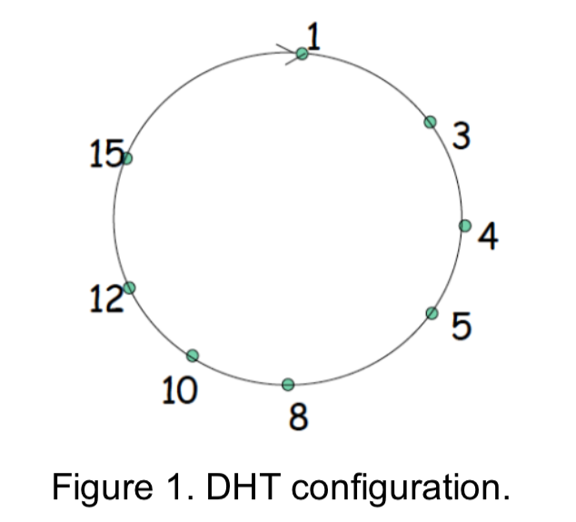

# peer-to-peer-P2P-protocol-Circular-DHT
P2P  DHT

## Aim
implement a part of the peer-to-peer (P2P) protocol Circular DHT . A primary requirement for a P2P application is that the peers form a connected network at all time. A complication that a P2P network must be able to deal with is that peers can join and leave the network at any time. For example, if a peer leaves the network suddenly (because it has crashed), then the remaining peers must try to keep a connected network without this peer. It is therefore necessary to design P2P networks so that they can deal with these complications.

## Background
In P2P systems, a peer can come or go without warning. Thus, when designing a DHT, we also must be concerned about maintaining the DHT overlay in the presence of such peer churn. To get a big-picture understanding of how this could be accomplished, let’s once again consider the DHT in Figure 2.27(a) [Reproduced here as Figure 1]. To handle peer churn, we will now require each peer to track (that is, know the IP address of) its first and second successor; for example, peer 4 now tracks both peer 5 and peer 8. We also require each peer to periodically verify that its two successors are alive (for example, by periodically sending ping messages to them and asking for responses). Let’s now consider how DHT is maintained when a peer abruptly leaves. For example, suppose peer 5 in Figure 2.27(a)[Figure 1 in this assignment spec] abruptly leaves. In this case, the two peers preceding the departed peer (4 and 3) learn that 5 has departed, since it no longer responds to ping messages. Peers 4 and 3 thus need to update their successor state information. Let’s consider how peer 4 updates its state:
+ Peer4 replaces its first successor(peer5)with its second successor(peer8).
+ Peer 4 then asks its new first successor (peer 8) for the identifier and IP addresses of its immediate successor (peer 10). Peer 4 then makes peer 10 its
second successor.
Having briefly addressed what has to be done when a peer leaves, let’s now consider what happens when a peer wants to join the DHT. Let’s say a peer with identifier 13 wants to join the DHT, and at the time of joining, it only knows about peer 1’s existence in the DHT. Peer 13 would first send peer 1 a message, saying ”what will be peer 13’s predecessor and successor?” This message gets forwarded through the DHT until it reaches peer 12, who realises it will be peer 13’s predecessor and its current successor, peer 15, will become its successor. Next, peer 12 sends this predecessor and successor information to peer 13. Peer 13 can now join the DHT by making peer 15 its successor and by notifying peer 12 that it should be its immediate successor to peer 13.
